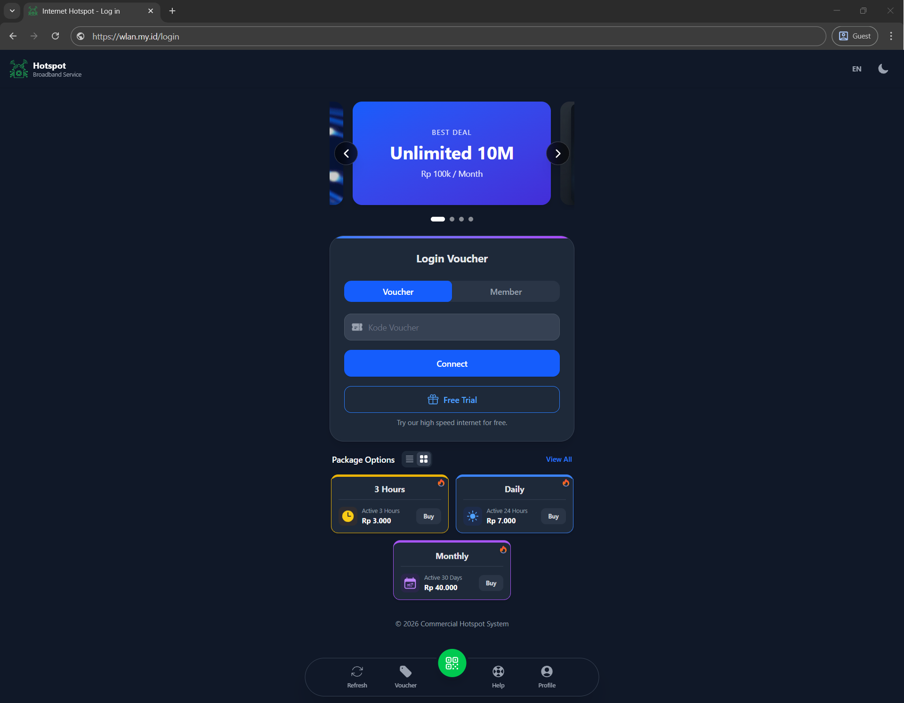
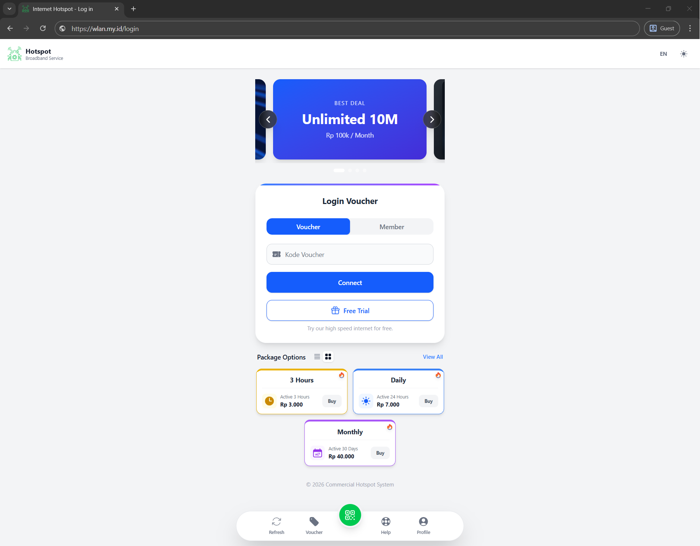
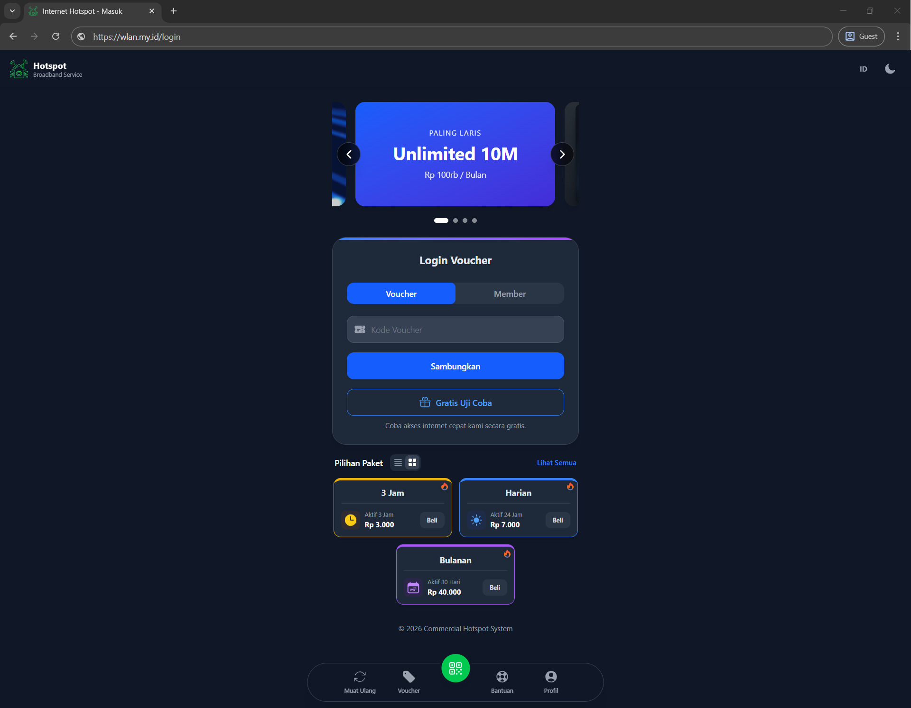
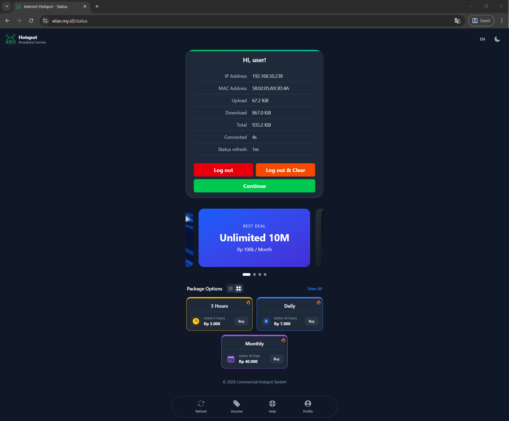

# MikroTik Hotspot Pages - Custom Commercial

**Versi Commercial** dari template hotspot MikroTik dengan fitur-fitur premium tambahan.

> [!NOTE]
> Template ini dibangun di atas **[Custom-Home](https://github.com/ihsanularifinm/MikroTik-Hotspot-Pages-Custom-Home)**.
> 
> 📖 **Untuk fitur dasar, tutorial instalasi, dan konfigurasi lengkap, silakan baca:**
> 
> 👉 **[README Custom-Home (Base Template)](https://github.com/ihsanularifinm/MikroTik-Hotspot-Pages-Custom-Home/blob/main/README.md)**

---

## ✨ Tampilan (Preview)

<p align="center">
  
  &nbsp;&nbsp;
  
</p>
<p align="center">
  
  &nbsp;&nbsp;
  
</p>

---

## ✨ Fitur Tambahan (Commercial Only)

Berikut adalah fitur-fitur **BARU** yang hanya tersedia di versi Commercial:

### 🎨 UI Premium
| Fitur | Deskripsi |
|-------|-----------|
| **Gradient Card Borders** | Login (biru→ungu), Status (hijau→teal), Logout (orange→merah) |
| **Bottom Navigation Bar** | Navbar floating modern dengan 5 quick actions |
| **Enhanced Card Styling** | `rounded-3xl`, `shadow-lg`, premium borders |

### 📱 Komponen Dinamis Baru

#### 1. Promo Slideshow
- Carousel dengan support **gambar, video, dan GIF**
- Navigasi prev/next dengan tombol bulat
- Dots indicator
- Modal detail saat slide diklik
- Autoplay dengan interval konfigurabel

#### 2. Voucher List
- Daftar paket/voucher yang dapat dikonfigurasi
- Mode tampilan **Grid** atau **List**
- Badge **"Best Seller"** untuk paket unggulan
- Warna kustom per voucher (blue, green, yellow, purple, red, cyan)
- Link action ke WhatsApp atau halaman pembelian

#### 3. Profile Modal
- Informasi bisnis lengkap (nama, tagline, deskripsi)
- Kontak (telepon, lokasi)
- Social media links (WhatsApp, Facebook, Instagram)

#### 4. Help/FAQ Modal
- FAQ accordion yang dapat dikonfigurasi
- Multi-bahasa support untuk pertanyaan dan jawaban

#### 5. Enhanced Status Card
Menampilkan informasi lengkap:
- IP Address & MAC Address
- Upload, Download, **Total Traffic** (`$(bytes-total-nice)`)
- Connected Time (Uptime)
- Time Left / Quota Left
- Status Refresh countdown
- (Opsional) Expired date dari RADIUS

#### 6. Enhanced Logout Card
- Ringkasan sesi dengan semua statistik traffic
- Styling konsisten dengan status card

### 🔧 Fitur Teknis Baru

| Fitur | Deskripsi |
|-------|-----------|
| **Dynamic Content Rendering** | Voucher, FAQ, Profile, Slideshow di-render dari `config.js` |
| **Auto Language Re-render** | Konten dinamis otomatis update saat bahasa diganti |
| **Event Delegation** | QR button bekerja meskipun navbar di-inject secara dinamis |
| **Component Injection** | Navbar dan sections di-inject via JavaScript templates |

---

## 📁 File JavaScript Tambahan

| File | Deskripsi |
|------|-----------|
| `js/navbars.js` | Template top navbar & bottom navbar |
| `js/sections.js` | Template slideshow & footer |
| `js/modals.js` | Template modals (pricing, help, profile, slide detail) |

---

## 🔧 Konfigurasi Tambahan (`config.js`)

Selain konfigurasi dasar dari Custom-Home, versi Commercial menambahkan:

```javascript
const hotspotConfig = {
    // ... (konfigurasi dasar dari Custom-Home)
    
    // ===========================
    // SLIDESHOW (COMMERCIAL)
    // ===========================
    enableSlideshow: true,
    slideshowAutoplay: true,
    slideshowInterval: 5000,
    slideshowItems: [
        { 
            type: 'image',  // 'image' atau 'video'
            src: 'img/promo1.jpg',
            alt: 'Promo Image',
            detail: {
                title: { en: 'Special Offer', id: 'Penawaran Spesial' },
                description: { en: '...', id: '...' },
                price: { en: 'Rp 50.000', id: 'Rp 50.000' },
                validity: { en: '7 Days', id: '7 Hari' },
                actionUrl: 'https://wa.me/628xxx'
            }
        },
        // ...
    ],
    
    // ===========================
    // VOUCHER LIST (COMMERCIAL)
    // ===========================
    vouchers: [
        { 
            title: { en: '1 Day', id: '1 Hari' },
            price: { en: 'Rp 5.000', id: 'Rp 5.000' },
            active: { en: '1 Day', id: '1 Hari' },
            color: 'blue',
            bestSeller: true,
            actionUrl: 'https://wa.me/628xxx?text=Beli%20voucher%201%20Hari'
        },
        // ...
    ],
    
    // ===========================
    // FAQ / HELP (COMMERCIAL)
    // ===========================
    faq: [
        { 
            question: { en: 'How to login?', id: 'Cara login?' },
            answer: { en: 'Enter your voucher code...', id: 'Masukkan kode voucher...' }
        },
        // ...
    ],
    
    // ===========================
    // PROFILE MODAL (COMMERCIAL)
    // ===========================
    profile: {
        logo: 'img/smart-home.svg',
        name: 'Smart Hotspot',
        brandName: 'Hotspot',
        tagline: { en: 'Broadband Service', id: 'Layanan Internet' },
        shortTagline: { en: 'Fast Internet', id: 'Internet Cepat' },
        description: { 
            en: 'Thank you for using our service.', 
            id: 'Terima kasih telah menggunakan layanan kami.' 
        },
        phone: '0812-3456-7890',
        location: { en: 'Jakarta, Indonesia', id: 'Jakarta, Indonesia' },
        socialMedia: {
            whatsapp: 'https://wa.me/628123456789',
            facebook: 'https://facebook.com/yourpage',
            instagram: 'https://instagram.com/yourprofile'
        }
    },
    
    // ===========================
    // STATUS PAGE FIELDS (COMMERCIAL)
    // ===========================
    statusFields: {
        showIP: true,
        showMAC: true,
        showUpload: true,
        showDownload: true,
        showTotal: true,
        showUptime: true,
        showTimeLeft: true,
        showQuotaLeft: true,
        showExpired: false,
        expiredSource: 'disabled'  // 'radius', 'api', atau 'disabled'
    }
};
```

---

## 🌐 Terjemahan Tambahan

Versi Commercial menambahkan key terjemahan baru di `app.js`:

```javascript
// Status/Logout fields
'upload': 'Upload' / 'Unggah',
'download': 'Download' / 'Unduh',
'total_traffic': 'Total' / 'Total',
'time_left': 'Time left' / 'Sisa waktu',
'quota_left': 'Quota left' / 'Sisa kuota',
'expired': 'Expired' / 'Kadaluarsa',

// Navbar
'nav_refresh': 'Refresh' / 'Muat Ulang',
'nav_voucher': 'Voucher' / 'Voucher',

// Modals
'profile_title': 'Profile' / 'Profil',
'help_title': 'Help' / 'Bantuan',
// ... dan lainnya
```

---

## 📋 Changelog dari Custom-Home

### ➕ Added
- Bottom navigation bar dengan 5 menu (Refresh, Voucher, QR, Help, Profile)
- Promo slideshow dengan modal detail
- Voucher list dengan grid/list toggle
- Profile modal dengan social media links
- FAQ/Help modal dengan accordion
- Enhanced status card dengan field lengkap
- Enhanced logout card dengan statistik traffic
- Gradient top borders pada semua cards
- `$(bytes-total-nice)` untuk total traffic

### 🔄 Changed
- Card styling: `rounded-lg` → `rounded-3xl`
- Shadow: `shadow-md` → `shadow-lg`
- Border: Added `border-gray-100 dark:border-gray-700`
- Slideshow nav buttons positioned relative to slides only

---

## 🙏 Credits

- **Base Template**: [MikroTik-Hotspot-Pages-Custom-Home](https://github.com/ihsanularifinm/MikroTik-Hotspot-Pages-Custom-Home)
- **Icons**: [Heroicons](https://heroicons.com/)
- **QR Library**: [html5-qrcode](https://github.com/mebjas/html5-qrcode)

---

**Made with ❤️ for MikroTik Community**
